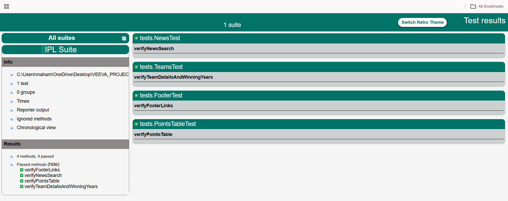

# IPL Web Automation Testing Suite

A specialized, end-to-end automation framework engineered to validate the functional integrity, UI consistency, and data accuracy of a high-traffic Indian Premier League (IPL) web portal.

---

## Project Overview

This suite ensures that dynamic elements such as real-time team statistics, historical trophy records, and live-updating points tables remain accurate across diverse browser updates and UI refreshes. It serves as a robust regression framework, significantly reducing manual testing overhead and minimizing the risk of human error in the verification of critical, fast-changing sports data.

---

## Key Functional Areas

| Area | Description |
|------|-------------|
| **Dynamic Data Scraping** | Verifies team trophies and winning years via hover-activated tooltip interactions using coordinate-based triggers and event-driven automation |
| **UI Integrity and Visual Consistency** | Validates branding elements like logos and navigational components like header and footer links across various screen resolutions |
| **Real-Time Data Accuracy** | Cross-verifies Points Table data such as Rank, Matches, and Points against expected datasets |
| **Operational Robustness** | Handles asynchronous elements including cookie banners, third-party ads, and lazy-loading team cards to prevent flaky tests |

---

## Project Architecture

The project adheres to a Modular Page Object Model (POM) architecture, strictly decoupling test logic from the UI structure.

```
[ Resource Layer ] <------ [ Suite Config (testng.xml) ]
        |                              |
        v                              v
[ Base Layer (BaseTest.java) ] --> [ Test Layer (Test Scripts) ]
        |                                      ^
        v                                      |
[ Page Layer (POM Classes) ] -----------------/
     (HP, TP, PP)
```

### Component Hierarchy

**1. Base Layer - BaseTest.java**

Manages the full WebDriver lifecycle. Configures browser-specific capabilities including headless execution, incognito mode, and implicit/explicit timeouts. Executes teardown via driver.quit() after every suite run to prevent memory leaks.

**2. Page Layer - POM Classes**

Uses the PageFactory pattern with @FindBy annotations. Classes include IPLHomePage.java and TeamPage.java. Provides high-level action methods such as searchForTeam() and getPointsTableData() while hiding complex XPaths from the test layer.

**3. Test Layer**

Contains core business logic and validation rules. Uses @Test, @BeforeMethod, and @AfterMethod annotations. Performs hard and soft assertions to validate actual versus expected UI state.

**4. Resource Layer**

testng.xml handles parallel execution, test grouping, and parameterization. pom.xml manages dependency lifecycle for Selenium 4.x, TestNG, and WebDriverManager.

### Advanced Design Patterns

**Singleton/Factory Pattern** - Custom Driver Factory prevents unnecessary multiple browser instances, optimizing system resource consumption.

**Fluent Wait / Explicit Strategy** - WebDriverWait combined with ExpectedConditions replaces unreliable Thread.sleep() calls.

**Actions Class Orchestration** - Chains complex mouse interactions such as hover, wait for animation, and capture tooltip data to simulate genuine human interaction.

---

## Test Case Documentation

### TC 001 - Footer Link Integrity Validation

**Objective:** Verify structural completeness of the global footer across four categories: TEAM, ABOUT, GUIDELINES, and CONTACT.

**Challenge:** High-density links (29 per section) may be obscured by dynamic sticky footers overlapping the bottom of the viewport.

**Solution:** Collection-based approach using List of WebElement. The script identifies parent containers for each section and retrieves all child anchor tags. Validating the size of these lists ensures the site's structural integrity remains intact.

**Execution Output:**

```
TEAM links count:       29
ABOUT links count:      29
GUIDELINES links count: 29
CONTACT links count:    29
```

---

### TC 002 - Dynamic Team Logo and Trophy Verification

**Objective:** Validate visual rendering of all 10 team identities and accuracy of their historical trophy counts.

**Challenge:** Winning years are hidden within hover-activated tooltips that do not exist in the DOM until the hover event is triggered. Newer teams like LSG and DC have no trophies, so the script must handle missing trophy icons without crashing.

**Solution:** A Hover-and-Extract logic was developed. For each team card, the script performs a moveToElement() action and uses a partial CSS selector to capture trophy icons dynamically. A conditional logic handler gracefully logs NO_TITLES for teams without wins.

**Execution Output:**

```
Processing team: CHENNAI SUPER KINGS
  CHENNAI SUPER KINGS - Logo: PASS
  Found winning years: 2010 | 2011 | 2018 | 2022
  CHENNAI SUPER KINGS - Winning Years: PASS

Processing team: DELHI CAPITALS
  DELHI CAPITALS - Logo: PASS
  DELHI CAPITALS - Hover years detected: NO_TITLES
  DELHI CAPITALS - No Titles: PASS
```

---

### TC 003 - Points Table Data Synchronization

**Objective:** Ensure the live data grid accurately reflects the current league standings, focusing on the Rank 1 team.

**Challenge:** HTML table row indices shift as teams win or lose matches. Hard-coding the row number would cause the test to fail the moment standings change.

**Solution:** Relative XPaths and the following-sibling axis were used. By anchoring the search to the Rank 1 text, the script dynamically finds adjacent cells for Team Name, Matches Played, and Total Points. This anchor-and-offset strategy ensures the test remains valid regardless of which team leads the table.

**Execution Output:**

```
Rank 1 Team: RR
  Team Name check:      PASS -> RR
  Matches Played check: PASS -> 3
  Points check:         PASS -> 6
Points Table Test PASSED for team: RR
```

---

### TC 004 - Global Search Accuracy

**Objective:** Test the search engine's indexing capabilities and ensure the UI correctly displays filtered results.

**Challenge:** The search overlay often triggers a global cookie consent banner that physically blocks the input field, causing ElementClickIntercepted errors.

**Solution:** A Pre-Action utility was built to check for cookie banner visibility before every search. If detected, the banner is closed. After inputting the search term, visibilityOfAllElementsLocatedBy ensures results are fully rendered before the final assertion is performed.

**Execution Output:**

```
No cookie popup detected
Search Results: 6
```

---
## Test Execution Report



## Technical Stack

| Component | Technology |
|-----------|------------|
| **Language** | Java 11 / 17 |
| **Automation Tool** | Selenium WebDriver v4.x |
| **Test Framework** | TestNG v7.11.0 |
| **Browser** | Chrome v146 via ChromeDriver |
| **Logging** | SLF4J (Simple Logging Facade) |
| **Design Pattern** | Page Object Model with PageFactory |
| **Build Tool** | Maven |

---

## Execution Summary

| Metric | Value |
|--------|-------|
| Total Tests Executed | 4 |
| Successful Passes | 4 |
| Failures / Skips | 0 |
| Total Execution Time | ~68 seconds |
| Environment | Clean-room (no local cache or cookies) |

The suite is confirmed stable, repeatable, and ready for integration into a CI/CD pipeline for daily health checks.

---

## Getting Started

### Prerequisites
- JDK 11 or higher
- Apache Maven
- Google Chrome (v146 or above)

### Setup and Execution

```bash
# Clone the repository
git clone <your-repository-url>

# Navigate to the project directory
cd ipl-web-automation

# Install dependencies
mvn install

# Run the full test suite
mvn clean test
```

Test reports will be generated in the target folder after execution.

---

## Team Contributions

**Mupparaju Sai Ram - Framework Backbone and Data Reliability**

Responsible for the architectural setup of the BaseTest class and the implementation of the complex Points Table synchronization logic (TC 003). Specialized in developing robust anchor-based XPath strategies for dynamic HTML tables and ensured footer link validations were synchronized across multiple browser viewports.

**Mahammad Reshma - Interactive UI Components and Synchronization Utilities**

Developed the interactive Hover logic for Team Cards (TC 002) and designed the Global Search module (TC 004). Focused on user-centric features of the site, implementing the Actions class workflows and the Smart-Cookie handler that prevents test interruptions from intrusive marketing pop-ups and overlays.

---

## Acknowledgements

Selenium and TestNG Open Source Communities
